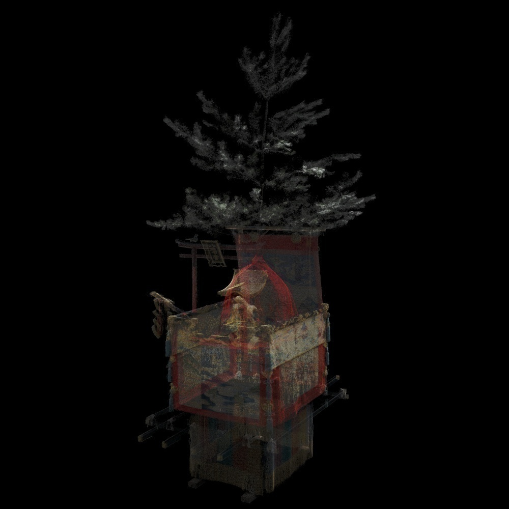
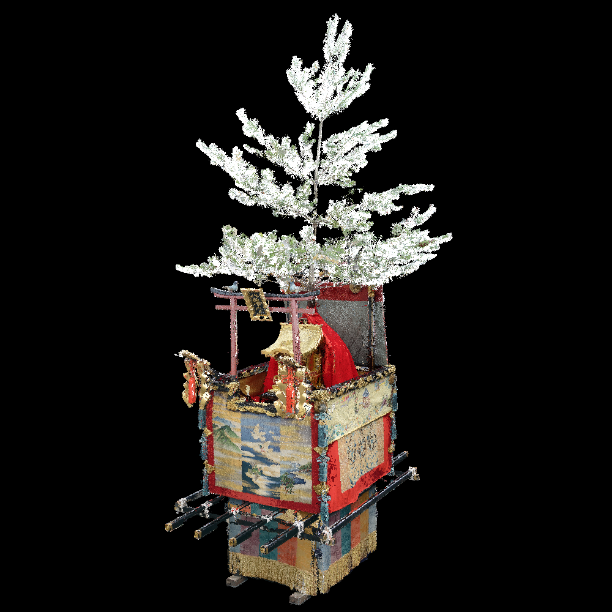
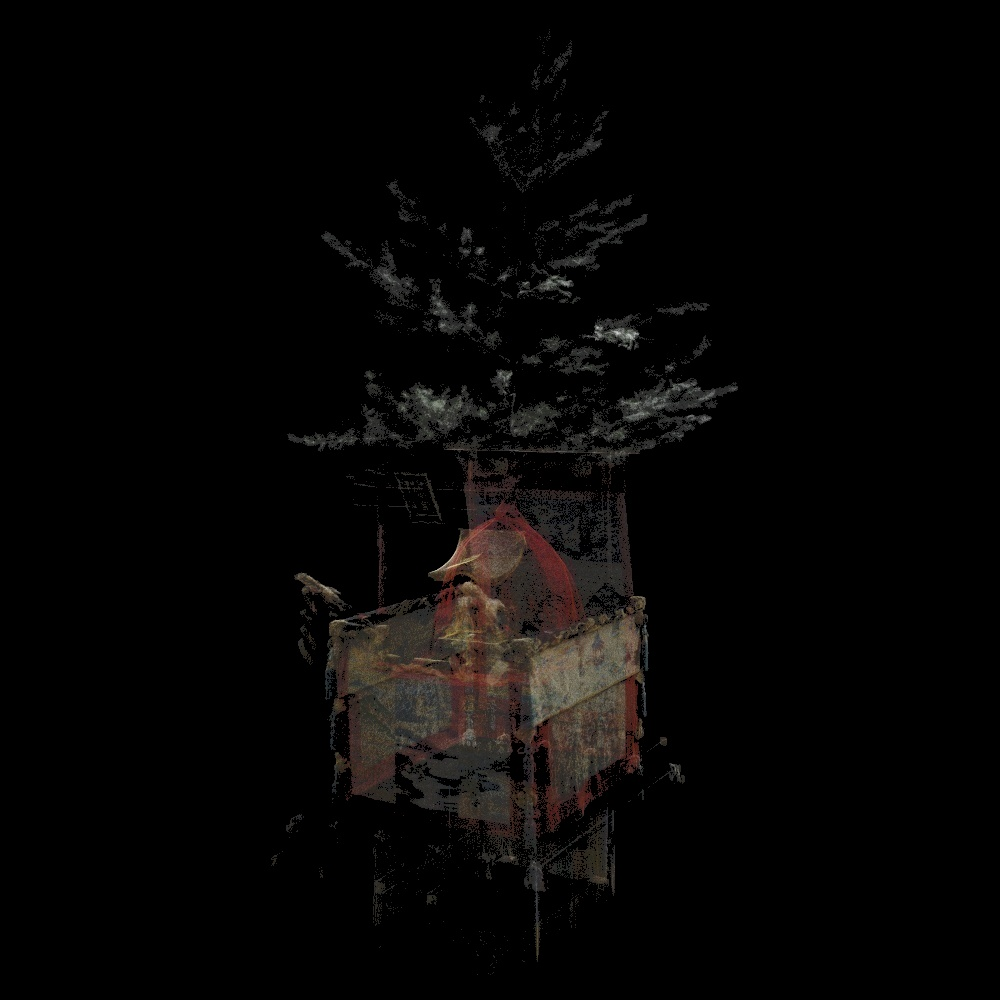
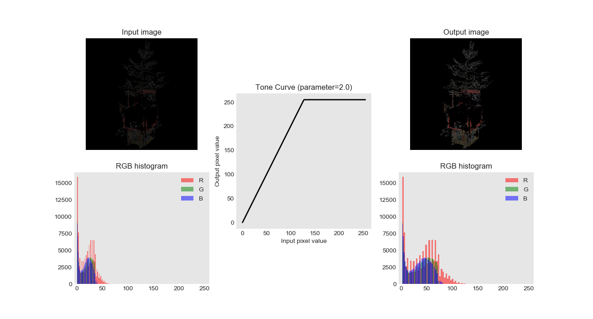
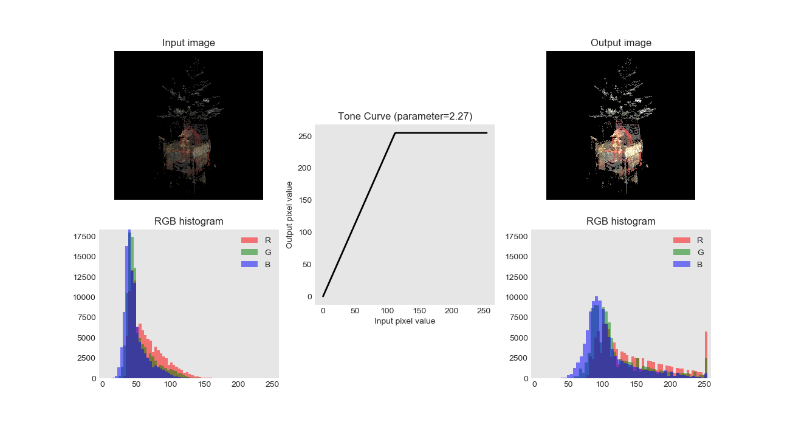

# Automatically Correct Pixel Value

## Simple version

### Demo

### Input image

### Input image (LR=1)

### Improved image

### Figure

## Decomposed version (now developping)

### Input image

### Decomposed images
#### Low pixel value image

#### Improved low pixel value image

#### High pixel value image

#### Improved high pixel value image

### Improved image

### Figures
#### Figure(low)

#### Figure(high)
