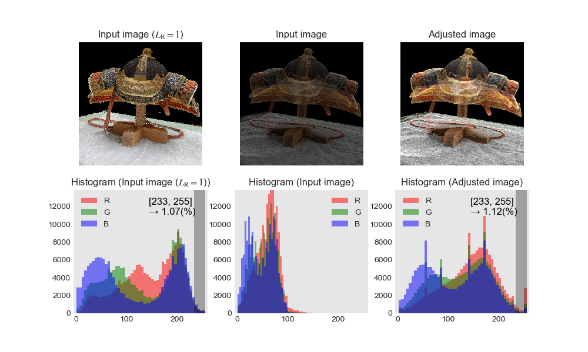

## Brightness Adjustment

### Overview
Adjust brightness of an image automatically.

#### Usage
```
$ python adjust_brightness.py
===============================
     Brightness Adjustment
       Tomomasa Uchida
         2019/02/28
===============================

USAGE   : $ python adjust_brightness.py [input_image_data] [input_image_data(L=1)]
EXAMPLE : $ python adjust_brightness.py [input_image.bmp] [input_image_LR1.bmp]
```

#### Example
```
$ python adjust_brightness.py images/IMAGE_DATA/kabuto_alpha02_LR200_black.bmp images/IMAGE_DATA/kabuto_alpha02_LR1_black.bmp
===============================
     Brightness Adjustment
       Tomomasa Uchida
         2019/02/28
===============================

Input image data (args[1])       : images/IMAGE_DATA/kabuto_alpha02_LR200_black.bmp
Input image data(L=1) (args[2])  : images/IMAGE_DATA/kabuto_alpha02_LR1_black.bmp


==================================
 STEP1: Get max pixel value (L=1)
==================================
Input image (RGB)               : (512, 512, 3)
N_all                           : 262144 (pixels)
N_all_non_bgcolor               : 176317 (pixels)
Max pixel value                 : 173 (pixel value)
Mean pixel value                : 54.7 (pixel value)

Max pixel value (L=1)           : 255 (pixel value)
Mean pixel value (L=1)          : 134.4 (pixel value)
Num. of max pixel value (L=1)   : 19 (pixels)
Ratio of max pixel value (L=1)  : 0.01 (%)
Most frequent pixel value (L=1) : 204 (pixel value)


===============================================
 STEP2: Search for reference pixel value (L=1)
===============================================
Reference pixel value (L=1)     : 234 (pixel value)
Reference section (L=1)         : 234 ~ 255 (pixel value)
Ratio of reference section (L=1): 1.07 (%)


===========================
 STEP3: Adjust pixel value
===========================
p_final                         : 2.4
Ratio of reference section      : 1.11 (%)
```

### Result

#### Input image


#### Input image ($L=1$)


#### Adjusted image


#### Figure
