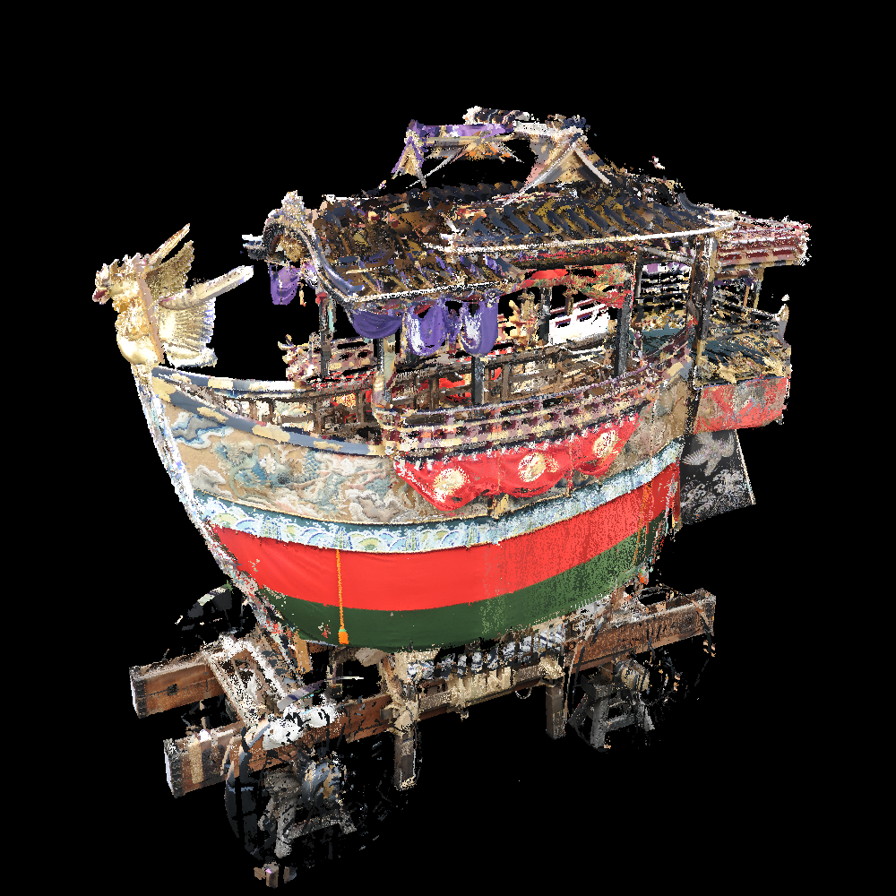
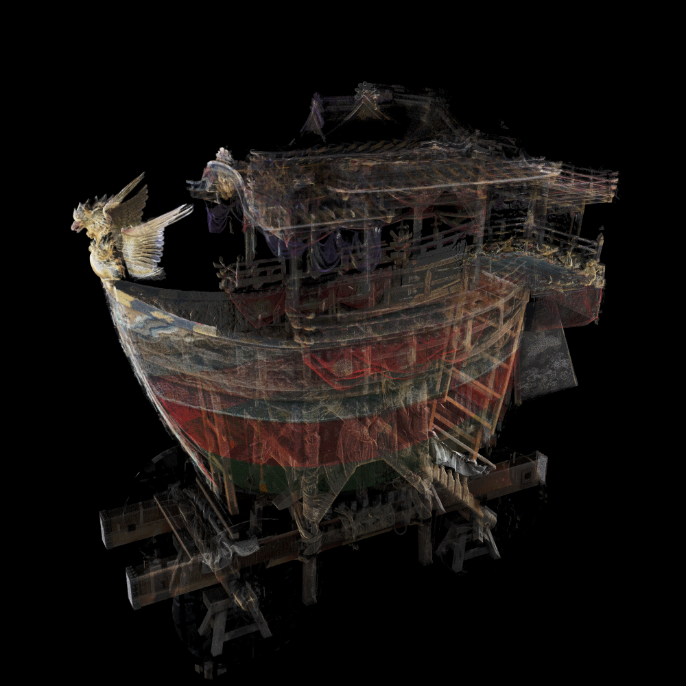
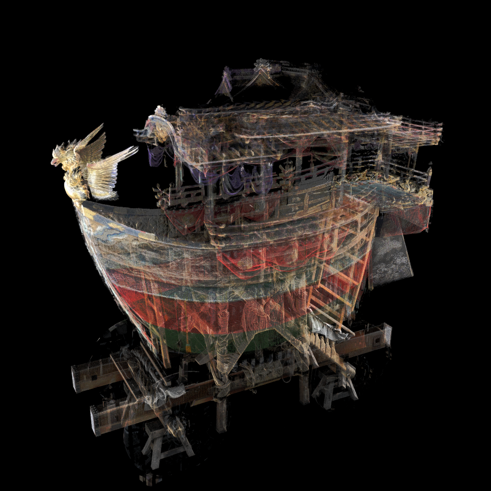
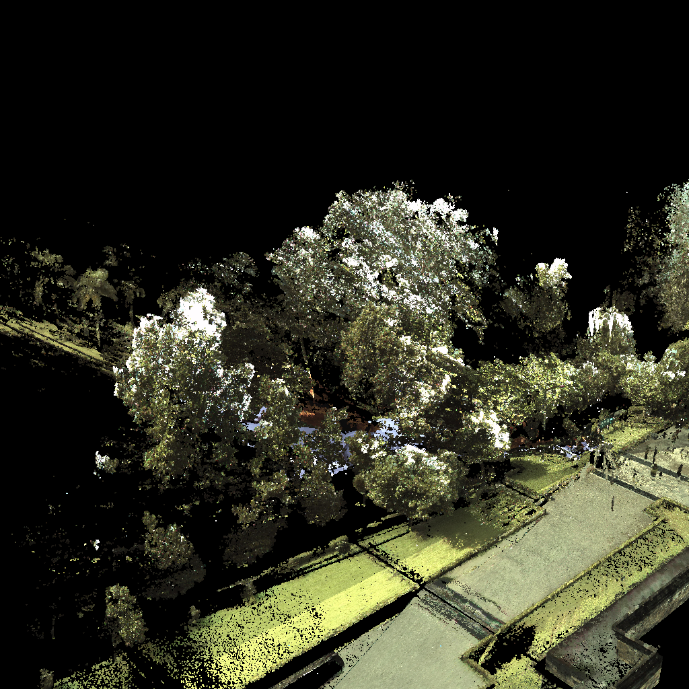
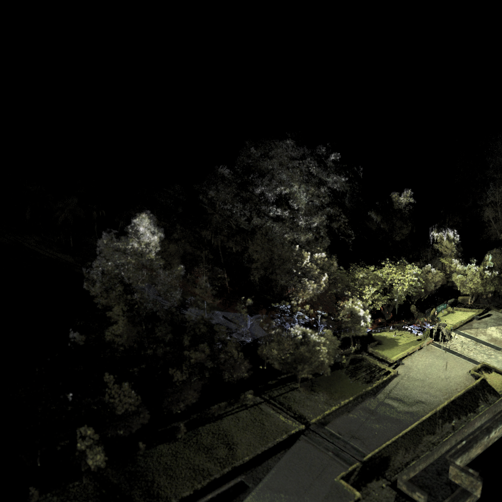
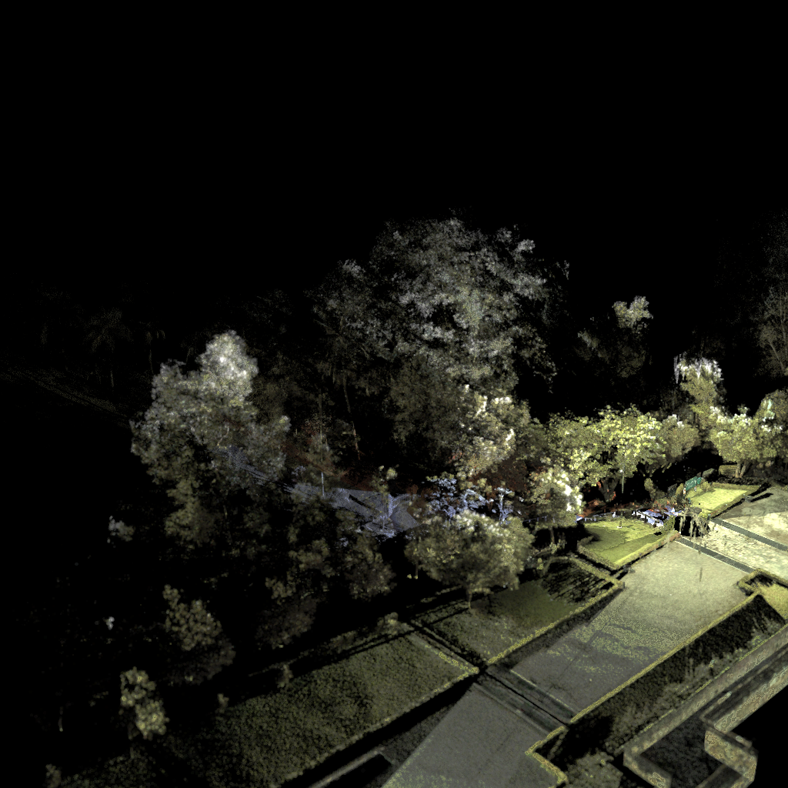
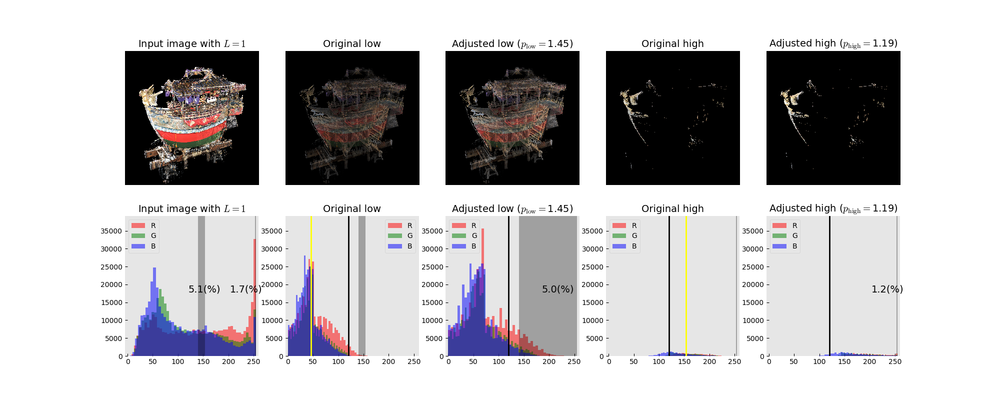
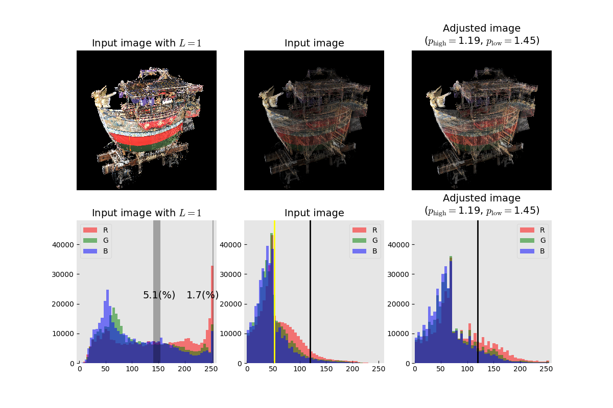
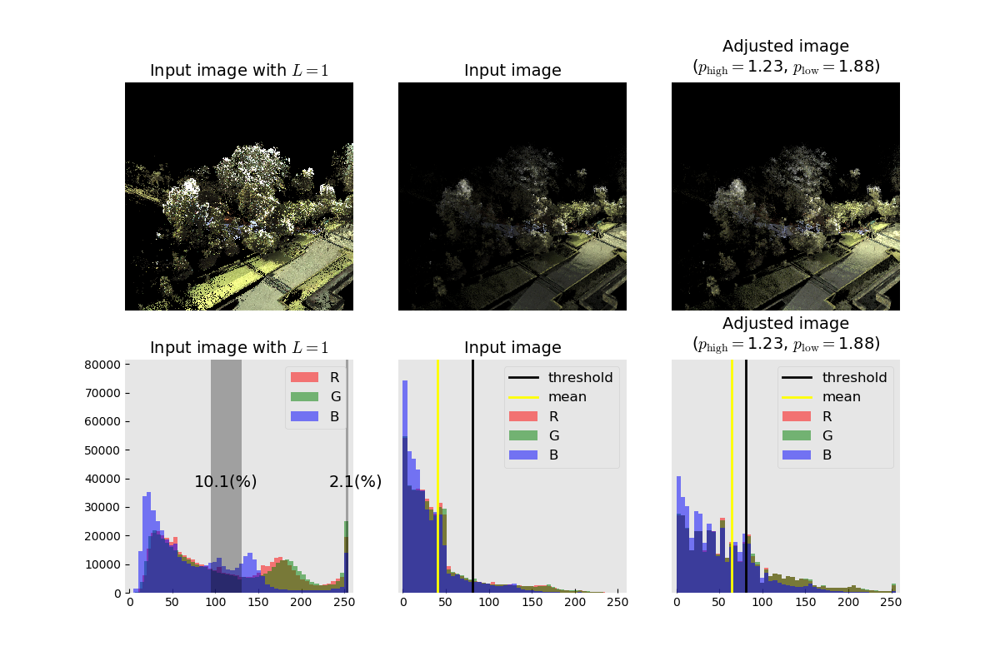

## Brightness Adjustment: Decompose version

### Overview
Adjust brightness of an image automatically.

#### Usage
```
$ python adjust_brightness_decompose.py
=============================================================================
                  Brightness Adjustment: Decompose ver.
                            Tomomasa Uchida
                              2019/11/28
=============================================================================


USAGE   : $ python adjust_brightness_decompose.py [input_image_data] [input_image_data(L=1)]
EXAMPLE : $ python adjust_brightness_decompose.py [input_image.bmp] [input_image_L1.bmp]
```

#### Example
```
$ python adjust_brightness_decompose.py IMAGE_DATA/SAMPLE_IMAGE_DATA/funehoko_LR100.bmp IMAGE_DATA/SAMPLE_IMAGE_DATA/funehoko_LR1.bmp 
=============================================================================
                  Brightness Adjustment: Decompose ver.
                            Tomomasa Uchida
                              2019/11/28
=============================================================================


Input image data        (args[1])      : IMAGE_DATA/SAMPLE_IMAGE_DATA/funehoko_LR100.bmp
Input image data (L=1)  (args[2])      : IMAGE_DATA/SAMPLE_IMAGE_DATA/funehoko_LR1.bmp
p_init                                 : 1.0
p_interval                             : 0.01
The pct. of ref. section (high image)  : 1.0 (%)
The pct. of ref. section (low image)   : 5.0 (%)
Background color                       : [0, 0, 0]
Background color (Grayscale)           : 0 (pixel value)
Input image (RGB)                      : (1000, 1000, 3)
N_all                                  : 1000000 (pixels)
N_all_non_bgcolor                      : 380453 (pixels)
Max pixel value                        : 244 (pixel value)
Mean pixel value                       : 52 (pixel value)
Std pixel value                        : 34 (pixel value)

Max pixel value (L=1)                  : 255 (pixel value)
Mean pixel value (L=1)                 : 123 (pixel value)
Num. of max pixel value (L=1)          : 6416 (pixels)
The pct. of max pixel value (L=1)      : 1.68 (%)
Most frequent pixel value (L=1)        : 255 (pixel value)


=============================================================================
   Step1. Decompose the input image to "high" and "low" pixel value images
=============================================================================
Threshold pixel value                  : 120 (pixel value)
The pct. of high pixel values          : 5.0 (%)
The pct. of low pixel values           : 95.0 (%)
Mean pixel value (high image)          : 154 (pixel value)
Mean pixel value (low image)           : 46 (pixel value)


=============================================================================
   Step2. Adjust brightness of the "high" pixel value image
=============================================================================
Theoretical pct. of ref. section (L=1) : 1.0 (%)
Reference section (L=1)                : [ 253 , 255 ] (pixel value)
Actual pct. of ref. section (L=1)      : 1.7 (%)

Determined amplification factor "p"    : 1.19
Final pct. of ref. section             : 1.2 (%)


=============================================================================
   Step3. Adjust brightness of the "low" pixel value image
=============================================================================
Theoretical pct. of ref. section (L=1) : 5.0 (%)
Reference section (L=1)                : [ 140 , 154 ] (pixel value)
Actual pct. of ref. section (L=1)      : 5.1 (%)

Determined amplification factor "p"    : 1.45
Final pct. of ref. section             : 5.0 (%)


=============================================================================
   Step4. Resynthesis "high" and "low" pixel value images
=============================================================================
Amplification factor "p_high"          : 1.19
Amplification factor "p_low"           : 1.45

Processing time                        : 0.59 [sec]
```

### Result

#### Images
|Input image ($L=1$)|Input image|Adjusted image|
|:-:|:-:|:-:|
||||

|Input image ($L=1$)|Input image|Adjusted image|
|:-:|:-:|:-:|
||||

#### Histogram





